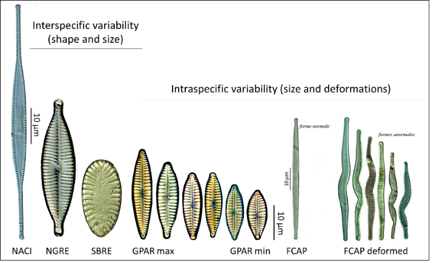
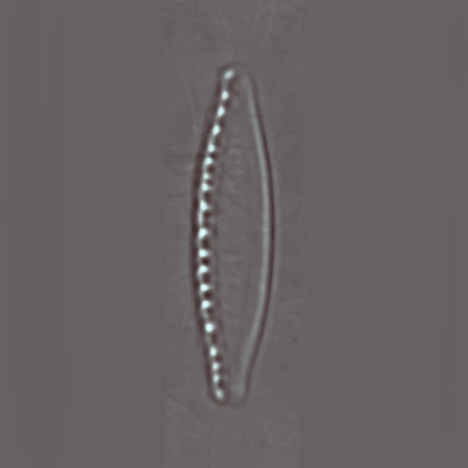

---
bibliography:
- GlyphoGAN.bib
---

<table>
  <tr>
    <td>
      
    </td>
    <td>
      
    </td>
  </tr>
</table>
----------------------------------------------------------------------------------------------------------------

<b>End of study project : Generative Adversarial Networks for automatic
identification of morphological changes in diatoms exposed to
glyphosate</b>

 

------------------------------------------------------------------------

 Selim Ollivier, Corentin Le Gall, Maxime Raillat 

<b>Mention SDI</b>
 
April 2023

<b> Supervised by :</b>  
Jérémy Fix 
Martin Laviale 
Aishwarya Venkataramanan

# Introduction

## Context

This project, in collaboration with the LIEC (Laboratoire
Interdisciplinaire des Environnements Continental Environments), focuses
on the analysis of diatom images. Diatoms are microalgae used as
bioindicators to characterise the ecological quality of watercourses.

There are different water quality indices, all of which can be
calculated from the observation of diatom species lists. Each species is
identified on the basis of microscopic observation of the morphology and
ornamentation of their silica exoskeleton. In addition, morphological
variations can also be observed within one species. But, the variations
observed between species and between individuals within a same species
are sometimes subtle and therefore difficult to discern for the human
expert (Figure [1.1](#fig:diatoms){reference-type="ref"
reference="fig:diatoms"}).

The value of observing diatoms to monitor the ecological quality of
watercourses lies in the fact that exposure to certain pollutants, such
as glyphosate, induces morphological changes in diatoms. Processes
involving supervised learning techniques have been used to classify
diatom images: given an image, it can be determined whether it is an
image of a diatom that has been exposed to glyphosate or not. However,
the issue with these techniques is that they are not easily
interpretable, and the deformations caused by exposure to glyphosate
cannot be identified (Figure [1.1](#fig:diatoms){reference-type="ref"
reference="fig:diatoms"}).\

<figure id="fig:diatoms">

 

<figcaption><strong>Examples of diatoms</strong> (Left) inter-species
similarities and intra-species diversity (Right) impacts of glyphosate
exposure</figcaption>
</figure>

The aim of this project is then to identify these sometimes subtle
deformations by means of unsupervised deep learning methods.\
Usually, unsupervised learning techniques are used to describe or
characterise a data set. This field can address several problems as data
partitioning, probability density estimation or dimension reduction.

The learning method on which this study is based is image generation by
adversarial networks (GANs). The aim of these deep neural networks is to
be able to generate very realistic images from a random noise sampled
from a latent space. Hence, the network learns a compressed
representation of the image space in order to generate realistic images
from random vectors sampled in latent space through a mapping between
latent and image spaces. This can therefore be interpreted as a
dimension reduction method.

Then, one can manipulate vectors in the latent space and observe the
corresponding deformations on the image space. Several models showed
that they offered a property of continuity to the constructed mapping :
close vectors in the latent space correspond to similar images (figure
[1.2](#fig:process){reference-type="ref" reference="fig:process"}). This
continuity property makes it possible to construct similarity measures
that are more relevant, on a semantic perspective, in latent space than
in image space. But, this requires the ability to back-project images
into latent space. Indeed, the GAN only gives a mapping from the latent
space to the image space.

Once the latent space has been constructed, and particularly in the
context of studying morphological features, one needs to be able to
identify relevant editing directions in the GAN latent space. Since 2014
and the introduction of GANs [@goodfellow_generative_2014], there has
been much work on the interpretability of GANs. Recently, several works
propose unsupervised algorithms to identify these directions. Many works
are based on StyleGAN which has a particular generative model structure
that seems particularly well suited to identify image editing
directions. 

<figure>
  
  <figcaption>
GAN generation, inversion and editing
processes
</figcaption>
</figure>

## Objectives and outline

The objectives of the project are :

1.  To classify diatoms with regards to the exposure or not to
    glyphosate in the latent space.

2.  To characterise the distribution of individuals exposed to
    glyphosate.

3.  To determine changes in morphological traits characteristic of
    exposure to glyphosate.

This project will thus be articulated in 3 main parts :

1.  Training of a GAN model over diatoms images.

2.  Implementation of an inverter to be able to back-project images in
    the latent space.

3.  Experimentation on the latent space : classification,
    caracterisation of probability distributions and identification of
    morphological traits characteristic.

A first dataset of about 3000 labelled images was collected in the LIEC,
as part of a laboratory experiment to study the potential effect of
glyphosate on the morphology of a diatom (species Nitzschia palea).
Cultures were exposed or not to glyphosate for 1 month, and then the
individuals from these cultures were photographed under the microscope.

# State of the art

## GANs

### What is a GAN ?

Generative Adversarial Networks (GANs) constitute a class of
unsupervised learning algorithms. It has been introduced in 2014 by Ian
Goodfellow [@goodfellow_generative_2014]. Mostly used for generative
applications, these models are able to generate very realistic data
(images, speeches, audios, videos\...) after training. A GAN is made of
two neural networks : a generator and a discriminator. The GAN training
principle comes from game theory and is known as **adversarial
learning** : while the generator's objective is to generate realistic
fake data from a random vecteur sampled in the latent space, the aim of
the discriminator is to distinguish fake data (from the generator) from
real data (dataset). The two networks are placed in competition and
train in parallel.\

<figure>
  
  <figcaption>
GAN training principle
</figcaption>
</figure

This training principle can however make the training very hard,
inducing instability, non convergence and mode collapse issues. The two
networks need to have a same level of performance, if not, the results
can be much less realistic. For instance, if the discriminator
outperforms the generator, it would not have the opportunity to learn
correctly and could lead to convergence issues. Conversely, if the
generator outperforms the discriminator, the generated fake images could
be unrealistic.\
In the followings, we will only address state of the art of GAN networks
trained to generate images.

### StyleGAN3 {#sec:styleGAN}

StyleGAN is a family of **style-based** generative adversarial networks
(GANs) [@karras_style-based_2019] [@karras_analyzing_2020]
[@karras_alias-free_2021] known for their ability to generate
high-quality and diverse images with fine-grained control over their
style and content, making them ideal for generating realistic images of
a wide range of objects, scenes, and characters. The particularity of
StyleGAN is that it implicitly learns a hierarchical representation of
the data. A classic GAN and a style-based GAN (StyleGAN1) architectures
are presented in figure [2.2](#fig:styleGAN){reference-type="ref"
reference="fig:styleGAN"}.

<figure>
  
  <figcaption>
<b>Style-based GANs architecture</b> : (Left) Classic GAN architecture
(Right) StyleGAN architecture : the networks learns a new latent space
that is further used to control image generation at different scales
</figcaption>
</figure

While the first two iterations of StyleGAN were able to generate very
realistic fake images, they faced a texture sticking problem : some high
resolutions details in generated images were glued to certain pixels.
The third and last version manage to fix this, offering translation and
rotation equivariant architectures (repectively denoted as StyleGAN3-T
and StyleGAN3-R). The main theoretical assumption of Karras et al.
[@karras_alias-free_2021] is to consider that the signal that flows
through the network is a sampled representation of a continuous signal.
They aim to ensure that for every transformation operated on the
discrete signal the corresponding operation on its continuous
counterpart is equivariant with respect to translation or rotation.

#### Architecture

StyleGAN models are composed of two sub modules : the networks first
learn a **mapping network** to map the original $z \in \mathcal{Z}$
latent code into an intermediate latent space $\mathcal{W}$. The so
obtained latent code $w$ is then used to compute style vectors. The
latter allows the **synthesis network** to control the generated image
style at different scales.\
The value of this type of network is that it gives a more interpretable
latent space. Furthermore, many works have shown that the so obtained
latent space $\mathcal{W}$ is more disentangled than its $\mathcal{Z}$
counterpart. This feature facilitates the downstream editing tasks
[@harkonen_ganspace_2020] [@shen_interpreting_2020]
[@wu_stylespace_2020].\
<figure>
  
  <figcaption>
<b>StyleGAN3 Architecture</b> [@karras_alias-free_2021] 
</figcaption>
</figure

##### Mapping network:

- This network $M$ aim is to map the original latent space $\mathcal{Z}$
in which latent codes are normally sampled vectors of dimension $512$ to
the $\mathcal{W}$ space. The network consists of stack of Fully
Connected Linear layers with non linear activations.

##### Synthesis network:

- The objective of this network is to generate images using style
modulation. It gradually increases the image resolution during the
generation process (i.e starting from a $16\times 16$ signal and
expanding it to a $1024 \times 1024$ resolution in the case of
StyleGAN3-T for instance) through a succession of so called style
blocks.\
From a $z\in\mathcal{Z}$ latent code, the obtained
$w = M(z) \in \mathcal{W}$ latent code is then used to compute different
**style vectors** using affine learned layers (denoted as green $A$
boxes in figure [2.3](#StyleGan3_architecture){reference-type="ref"
reference="StyleGan3_architecture"}). These vectors will allow to
control the style of the generated image throughout the progressive
process (see figure [2.3](#StyleGan3_architecture){reference-type="ref"
reference="StyleGan3_architecture"}).

The image generation process starts with constant **Fourier features**
map on which are computed rotation and translation transformation
depending on $w$ through the learned affine layer (see appendix for
further details on Fourier features and their justification in this
case). The Fourier features are of dimension $(1, 1, H, W)$ are then
passed through a $1\times 1 or 3 \times 3$ learned convlutional layer to
obtain feature maps of dimension $(B, C_0, H_0, W_0)$.

The process continues with a stack of **style blocks** that use
convolutionnal layers with weight demodulation [@karras_analyzing_2020]
followed by a $2m$ factor upsampling ($m=1$ if the index layer is even,
$m=2$ either), LeakyRELU activation and a factor $2$ downampling (the
non linear activation is in between upsampling and downsampling to
eliminate offending high-frequency content that may have been introduced
by non linear transformation performed on discrete signal).

Finally the image is converted to RGB format according to the last style
vector using the same method as in the style blocks without upsampling
and downsampling.

#### Losses

As GAN training involves 2 networks to be trained, one usually uses a
**generator loss** and a **discriminator loss**. Let $\in \mathcal{X}$
be a fake or real image. The aim of the critic/discriminator is to tell
if $x$ is a real or fake. It evaluates the probability for $x$ to be
real : $D(x) \in [0,1]$, with $D(x) \approx 1$ meaning it is surely a
real image and $D(x) \approx 0$ meaning it is surely a fake one. It has
to solve a binary classification problem which is often handled by
minimising the binary cross-entropy loss (BCE). For a set
$(x_i)_{1 \leq i \leq m}$ of real images and a set
$(z_i)_{1 \leq i \leq m}$ of random seeds, one computes :

$$\mathcal{L}_{c}    = 
    \frac{1}{2m} \sum_{i=0}^m 
    -\log \Bigl(D(x_{i})\Bigr) 
    -\log \Bigl(1 - D\bigl(G(z_{i})\bigr)\Bigr)$$

The generator on his side wants to fool the critic and therefore wants
its samples to be considered as real data. Therefore, it seeks to
minimize:

$$\mathcal{L}_{g} = \frac{1}{m} \sum_{i=0}^m -\log \Bigl(D\bigl(G(z_{i})\bigr)\Bigr)$$

In addition to the classical losses Karras et al.
[@karras_alias-free_2021] introduces regularization terms to both
losses.

-   **Perceptual Path Length (PPL)** : This loss encourages the network
    to ensure that a fixed-size step in the latent space $\mathcal{W}$
    corresponds to a fixed-size step in the image space $\mathcal{X}$.
    This condition is equivalent to enforce the generator's jacobian
    matrix $\mathbf{J}_w$ to be orthogonal at any point
    $w \in \mathcal{W}$. This is achieved minimizing the following
    expectancy [@karras_analyzing_2020] :
$$\mathcal{L}_\text{PPL} (G) = \mathbb{E}_{\substack{z \sim \mathcal{N}(0,I)\\ y \sim \mathcal{N}(0,I)}}
\left[ \left(
\left\|\mathbf{J}_w^T y \right\|_2 - a
\right)^2 \right]$$
 Where $w$ and $y$ are normally sampled
    in $\mathcal{W}$ and $\mathcal{X}$. $a$ is a variable dynamically
    fixed during training.

-   **R1 regularization** this term is added to the loss function of the
    discriminator to penalize large gradients of the discriminator
    output with respect to the input data. Let $D$ be the discriminator
    network, and let $x$ be a real or generated data sample. Then, the
    R1 regularization term is defined as:
    $$\mathcal{L}_{R1} (D) = \frac{1}{2} \left\|\nabla_x D(x)\right\|^2_2$$

Finally, these regularization terms are weigthed with hyperparameters
$\lambda, \mu \in \mathbb{R}$ and added to the two previously introduced
loss functions :

1.  **Generator** :
    $$\mathcal{L}_{g} = \frac{1}{m} \sum_{i=0}^m \log \Bigl(1 - D\bigl(G(z_{i})\bigr)\Bigr) + \lambda \mathcal{L}_{ppl}$$

2.  **Discriminator** : $$\mathcal{L}_{c} 
            = 
            \frac{1}{2m} \sum_{i=0}^m 
            -\log \Bigl(D(x_{i})\Bigr) 
            -\log \Bigl(1 - D\bigl(G(z_{i})\bigr)\Bigr) + \mu \mathcal{L}_{R1}$$

Regularization techniques such as R1 regularization can help to
stabilize the training process and prevent the generator from producing
unrealistic or low-quality samples. This is because regularization
encourages the discriminator to learn a more robust decision boundary
between real and generated samples, which can help to prevent the
generator from overfitting to the discriminator's feedback.
Regularization can also help to prevent mode collapse, where the
generator produces a limited set of samples that do not fully capture
the diversity of the real data distribution [@mescheder_which_2018].

#### Metrics {#subsubsec:GAN_metrics}

As the different losses are not necessarily meaningfull to evaluate the
quality of the trained GAN, some additionnal metrics can be added to
quantify the distance between the real and the fake image distribution :

1.  **Fréchet Inception Distance** : This metrics is common to evaluate
    GAN performances as it compares the distributions of the fake and
    real images in a feature space [@heusel_gans_2018]
    [@nunn_compound_2021]. One uses a pre-trained Inception-v3 network
    to extract feature maps and measure the Fréchet distance between the
    feature distribution of the generated images and the real images one
    for a given dataset. This is used to evaluate the overall quality of
    the generated image set compared to the training data set. These
    distributions are approximated by multivariate normal distributions
    $\mathcal{N}\left(\mu_\text{real}, \Sigma_\text{real}\right)$ and
    $\mathcal{N}\left(\mu_\text{fake}, \Sigma_\text{fake}\right)$. It
    allows one to compute the FID from the given formula:
    $$\mathrm{FID} 
            = 
            \left|\| \mu_\text{real} - \mu_\text{fake}\right\|_2^{2}
            + 
            \mathrm{Tr} \left(\Sigma_\text{real} + \Sigma_\text{fake} -2  (\Sigma_\text{real}\Sigma_\text{fake})^{\frac{1}{2}}\right)$$

2.  **Kernel Inception Distance** (KID) is a metric that assesses the
    quality of a generated image set by measuring the distance between
    the feature distributions of the generated images and those of the
    real images. This metric is similar to the FID metric. The feature
    distribution of an image refers to the distribution of the features
    extracted from that image. These features are extracted using a
    pre-trained neural network, Inception-v3
    [@binkowski_demystifying_2021].

3.  **Precision and recall** are evaluation metrics used to measure the
    quality of the generated images in terms of their diversity and
    similarity to the real images. For each image in the real set, the
    distance to its k smallest/nearest neighbor in the generated set is
    computed. Similarly, for each image in the generated set, the
    distance (in the image space) to its k nearest neighbors in the real
    set is computed. The precision is then computed as the fraction of
    generated images for which at least one neighbor in the real set has
    a distance within the k nearest neighbor threshold. The recall is
    computed similarly as the fraction of real images for which at least
    one neighbors in the generated set has a distance within the k
    nearest neighbors threshold. The precision measures the ability of
    the model to generate high-quality images that are similar to the
    real ones, while the recall measures the ability of the model to
    generate a variety of images that cover the entire range of possible
    image variations.By considering both of these metrics, researchers
    and practitioners can gain a more comprehensive understanding of the
    strengths and weaknesses of their image generation models and can
    work to improve their performance accordingly.

4.  **Perceptual Path Length** : This metric measures the complexity of
    trajectories in latent space that produce coherent images using
    perceptual distance. It is computed by measuring the distance
    between images generated along smooth latent trajectories. This
    metric evaluates the quality of the set of generated images in terms
    of regularity and coherence.

5.  **Equivariance $\mathrm{EQ-T}$ or $\mathrm{EQ-R}$** : This metric
    measures the ability of the model to produce similar images when
    applying a translation or a rotation to the input images. It
    evaluates the equivariance with respect to translation
    $\mathrm{EQ-T}$ or the rotation $\mathrm{EQ-R}$.

## GAN Inversion

##### Problem formulation

: Once a satisfactory GAN has been trained, a reliable GAN inversion
process is needed to be able of editing real image with manipulations in
the latent space. Given an image, the inversion process aims to recover
a latent code that should allow a faithfull and photorealistic
reconstruction of the image and facilitate downstream tasks.\
Let us give a mathematical formulation of the GAN inversion problem :

-   Let $\mathcal{Z}$ be the latent space, $\mathcal{X}$ the image
    space.

-   The well trained GAN learns a mapping
    $G : \mathcal{Z} \to \mathcal{X}$.

-   One needs to introduce a distance metric
    $l : \mathcal{X}^2 \to \mathbb{R}_+$ in the image space. Usually
    $l(\cdot,\cdot)$ is based on a linear combination of $L^1$, $L^2$,
    $LPIPS$ (Learned Perceptual Image Patch Similarity
    [@zhang_unreasonable_2018]) norm or other perceptual and identity
    metrics.

Given an image $x \in \mathcal{X}$, the problem can be defined as
finding a latent code $z^* \in \mathcal{Z}$ so that the reconstructed
image $x^* = G(z^*)$ stays as close as possible to the original image
$x$ :
$$z^* \in \mathop{\mathrm{arg\,min}}_{z\in\mathcal{Z}} l\left(x, G(z)\right)$$

##### Inversion methods

: 4 main families of GAN inversion methods emerge from the litterature :

![**Principal GAN inversion methods**
[@{bermano_state---art_2022}]](Images/Report_picture/GAN inversion/Various-approaches-for-GAN-Inversion.png){#fig:GAN_inversion
width="70%"}

1.  **Optimization-based methods** : these directly solve the
    optimization problem for each latent code through a optimisation
    algorithm (gradient descent for instance) [@xia_gan_2022]
    [@huh_transforming_2020]. The main drawback of these methods is that
    the objective function is often non convex and therefore very
    sensitive to the initialisation. Then, one needs to perform the
    whole process for every image to invert. However, they have been
    shown to be superior in term of distortion minimisation
    [@xia_gan_2022].

2.  **Learning-based methods** : this kind of method aims to learn an
    encoder network $E : \mathcal{X} \to \mathcal{Z}$ that maps the
    image space to the latent space [@xia_gan_2022]
    [@zhu_generative_2018]. Once the encoder is learned, these methods
    have speed and computation cost advantages over their
    optimization-based counterparts mentionned above. But, as the
    encoder is trained on a whole dataset the performances do not match
    the optimization-based methods ones in terms of distortion. It often
    fails to faithfully reconstruct some images specificities such as
    glasses, hats, obstacles or particular backgrounds.

3.  **Hybrid methods** : these group of methods first uses an encoder
    network to obtain an initial latent code and then refines it with an
    optimization algorithm [@xia_gan_2022] [@zhu_generative_2018].

4.  **Generator tuning methods** : these methods perform an image
    specific optimisation process over the weights of the generator in
    order to adapt it and enable the image to be reconstructed as best
    as possible [@roich_pivotal_2021].
<figure>
  
  <figcaption>
Principal GAN inversion methods
</figcaption>
</figure

##### Choice of the latent space to embed:
 
The second goal of facilitating dowstream tasks could be achieved by
exploiting specific GANs architectures. For instance, StyleGAN models
use intermediate latent spaces $\mathcal{W}$ and $\mathcal{W}_+$ (see
Figure [2.3](#StyleGan3_architecture){reference-type="ref"
reference="StyleGan3_architecture"}) that have shown themselves to be
more disentangled than the first and basic $\mathcal{Z}$ latent space
and therefore to facilitate editing tasks [@karras_style-based_2019]
[@karras_analyzing_2020] [@karras_alias-free_2021]. Let us give more
specification of these spaces :

1.  **$\mathcal{Z}$ space** : In most GAN architecture, the generator
    learns to map the latent codes sampled from a multivariate normal
    distribution (or less often a uniform distribution). This constraint
    over the distribution limits the expressiveness and disentanglement
    of the latent representation. In the StyleGAN3 architecture the
    latent code $z$ has 512 dimensions.

2.  **$\mathcal{W}$ space** : In style-based architectures the networks
    first maps the latent space $\mathcal{Z}$ to an intermediate latent
    space $\mathcal{W}$ through the mapping network. This space has been
    shown to have a more disentangled representation than the
    $\mathcal{Z}$ space [@abdal_image2stylegan_2019]. This space is also
    made of 512 dimensions in the StyleGAN3 architecture.

3.  **$\mathcal{W}_+$ space** : The obtained latent code $w$ is then
    duplicated (16 times in the case of StyleGAN3, to constitute a
    $16\times512$ vector or matrix) to be passed in each layers of the
    synthesis network (figure
    [2.3](#StyleGan3_architecture){reference-type="ref"
    reference="StyleGan3_architecture"}). The so constructed duplicated
    latent codes constitute the $\mathcal{W}_+$ space. During the GAN
    training, the latent code $w$ is simply duplicated. But, it has been
    shown that this can limit the reconstruction performance. Whereas,
    if one allows to learn the $w_+$ latent code, i.e. feeding each
    style block of the synthesis network with different vectors, it has
    been showed that it enhances faithfullness of the reconstructed
    images at the expense of editability [@abdal_image2stylegan_2019].

### Autoencoders

Learning-based methods are grounded on autoencoders networks
[@bank_autoencoders_2021]. These networks aim to learn a compressed
representation of the data they are trained on. They are constituted of
2 networks (figure [2.5](#fig:autoencoders){reference-type="ref"
reference="fig:autoencoders"}):

-   The **Encoder** $E : \mathcal{X} \to \mathcal{Z}$ that maps the
    image space $\mathcal{X}$ to a latent space $\mathcal{Z}$.

-   The **Decoder** $D : \mathcal{Z} \to \mathcal{X}$ that maps the
    latent space $\mathcal{Z}$ to the image space $\mathcal{X}$.

<figure>
  
  <figcaption>
<b>Autoencoder principle</b> The encoder compresses the image into a
smaller latent representation in Z. The decoder decompress
it to get back to the image spaces X.
</figcaption>
</figure

The aim of an autoencoder is to find the networks parameters $\theta_E$
and $\theta_D$ that minimize the expected reconstruction error for a
random image $x : \Omega \to \mathcal{X}$ :
$$\left(\theta_E, \theta_D\right)
    \in
    \mathop{\mathrm{arg\,min}}_{\theta_E, \theta_D} \mathbb{E}\left[l \Bigl(x, D \bigl( E \left(x\right)\bigr)\Bigr)\right]$$

Where $l : \mathcal{X}^2 \to \mathbb{R}_+$ is a distance metric.\
In the context of GAN inversion, the autoencoders framework is used to
learn a decoder while the decoder is the frozen generator. The objective
thus become : $$\theta_E
    \in
    \mathop{\mathrm{arg\,min}}_{\theta_E} \mathbb{E}\left[l \Bigl(x, G \bigl( E \left(x\right)\bigr)\Bigr)\right]$$

Let $\mathcal{L} : \mathcal{X}^2 \to \mathbb{R}_+$ be a loss function,
and $\left(x_i\right)_{1\leq i \leq n}$ a set of $n$ images. The
learning problem aims to be solved trought the Empircal Risk
Minimisation algorithm [@xia_gan_2022] [@polyML] : $$\theta_E
    \in
    \mathop{\mathrm{arg\,min}}_{\theta_E} \sum_{i=1}^n \mathcal{L} 
    \Bigl(
    x, G \bigl( E \left(x\right)\bigr)
    \Bigr)$$

### Encoder4Editing {#sec:e4e}
 
One of the recent most performant encoder model for GAN inversion is
Encoder4Editing (e4e) [@tov_designing_2021]. As previous works
highlighted the existence of trade-offs in the GAN inversion processes.
The objective of the authors Tov et al. is to address these existing
tradeoffs. 

#### GAN inversion trade-offs {#sec:tradoffs}
 

##### Distortion-perceptual quality trade-off:
 
As mentionned before, it is expected from GAN inversion to achieve two
goals : minimize reconstruction error and facilitate editing tasks. The
reconstruction error can first be considered to be defined as the
**distortion** : the expected difference between the original image and
the reconstructed one
$\mathbb{E}\left[l\Bigl(x,G\bigl(E(x)\bigr)\Bigr)\right]$. But this does
not quantify reconstruction quality in a satisfactory way, as it does
not take **perceptual quality** of the reconstruction. Blau and Michaeli
[@blau_perception-distortion_2018] established a distinction between
distortion and perceptual quality. They not only proved that perceptual
quality is different of distortion, but, it exists a trade-off between
the two.

##### Distortion-editability trade-off

: On the other hand, as the principal motivation for GAN inversion is
edition and manipulation of image in the latent space, the estimated
latent code needs to allow easy, realistic and expressive manipulations.
As discussed above, it is well known that the inversion in the
$\mathcal{W}_+$ space achieves better distortion results than inversion
in the $\mathcal{W}$ space, while being less editable
[@abdal_image2stylegan_2019] [@richardson_encoding_2021].

Moreover, as StyleGAN is trained over $\mathcal{W}$ it is normal that it
achieves better perceptual quality than $\mathcal{W}_+$.\
Considering $\mathcal{W}$ to be a subspace of $\mathcal{W}_+$, Tov et
al. [@tov_designing_2021] showed that these tradeoffs are also present
within $\mathcal{W}_+$ as when the latent code gets closer to
$\mathcal{W}$, the editability and the perceptual quality are enhanced
while the distortion gets worser.

#### Architecture

The e4e architecture mainly reuses the **Pixel2Style2Pixel (pSp)**
architecture (figure [2.8](#fig:pSp){reference-type="ref"
reference="fig:pSp"}) [@richardson_encoding_2021], adding two training
principles to enhance perceptual quality and editability : progressive
style training and adversarial training with the use of a latent code
discriminator loss (figure [2.6](#fig:e4e){reference-type="ref"
reference="fig:e4e"}).

![**Encoder4Editing (e4e) architecture**. The encoder learns from the
image a single latent code $w$ and progressively learns $N-1$ offsets
$\Delta_i$. The offsets are added to $w$ to constitute the N style code
to be passed to the pretrained StyleGAN network. During training,
$\mathcal{L}_{\text{d-reg}}$ loss is computed over the offests and
$\mathcal{L}_{\text{adv}}$loss is computed over the obtained latent
codes $w_i$ using the latent code discriminator $D_\mathcal{W}$
[@tov_designing_2021].](Images/faces/e4e.png){#fig:e4e height="3.5cm"}

##### Progressive training

: Given an image $x \in \mathcal{X}$, the pSp encoder learns N latent
codes (where $N$ is the number of style layers in the pretrained
StyleGAN network) : $$E_{\text{pSp}}(x) = \left(w_1, ..., w_N\right)$$

Its e4e counterpart learns a single latent code $w$ and a set of $N-1$
offsets $\left(\Delta_1,...,\Delta_{N-1}\right)$ :
$$E(x) = E_{\text{e4e}}(x) = \left(w, w+\Delta_1..., w+\Delta_{N-1}\right)$$

Indeed, at the start of training, offsets are set to $0$ :
$\forall i \in \{1,...,N-1\},~~\Delta_i = 0$, and the encoder only
learns the latent code $w$. It is then allowed to progressively and
sequentially infer offsets. The idea is to first learn a coarse
representation in $\mathcal{W}$ and then gradually expand learning to
$\mathcal{W}_+$ to add finer details while maintaining proximity with
$\mathcal{W}$.

In order to remain as close as possible to $\mathcal{W}$, a $L^2$ delta
regularization loss is added :
$$\mathcal{L}_{d-reg} \left(w, w+\Delta_1..., w+\Delta_{N-1}\right)
    =
    \sum_{i=1}^{N-1} \|\Delta_i\|_2$$

##### Adversarial training

: The second inovation is to adopt a latent discriminator
$D_\mathcal{W} : \mathcal{Z} \to [0,1]$ trained in an adverasarial
manner to discrimine real latent codes generated from the StyleGAN
mapping function and the encoder's learned ones.

In every iteration, for a batch $(x_i)_{1 \geq i \geq n}$ of $n$ real
images, $n$ latent codes $(z_i)_{1 \geq i \geq n}$ are also normally
sampled in $\mathcal{Z}$ and passed throught the mapping network to
obtain $n$ latent codes in $\mathcal{W}$. For $1\leq j \leq N$, the GAN
loss with $R1$ regularization is computed over the so obtained latent
codes $w_j = E(x)_j$ : $$\begin{aligned}
    \mathcal{L}_{\text{adv},j}^D 
    \left((x_i)_{1 \geq i \geq n}, (z_i)_{1 \geq i \geq n}\right)
    &=
    - \frac{1}{n} \sum_{i=1}^n 
    \biggl(
    \log D_\mathcal{W}(w_i)
    + 
    \log \Bigr(1 - D_\mathcal{W} \bigl(E(x_i)_j\bigr)\Bigr)
    \biggl)\\
    \mathcal{L}_{\text{adv},j}^E
    &=
    - \frac{1}{n} \sum_{i=1}^n \log D_\mathcal{W}\bigl(E(x_i)_j\bigr)
\end{aligned}$$

These loss are then averaged so that : $$\mathcal{L}_{\text{adv}}^D 
    = 
    \frac{1}{N} \sum_{j=1}^N \mathcal{L}_{\text{adv},j}^D
    ~~~~~~~~~~~~~~
    \mathcal{L}_{\text{adv}}^E 
    = 
    \frac{1}{N} \sum_{j=1}^N \mathcal{L}_{\text{adv},j}^E$$

##### pSp architecture

: The pSp architecture (figure [2.8](#fig:pSp){reference-type="ref"
reference="fig:pSp"}) is mainly grounded on a residual network (ResNet,
figure [2.7](#fig:resnet){reference-type="ref" reference="fig:resnet"})
[@he_deep_2015] backbone from which 3 feature maps are extracted. The
$N$ style vectors $w_i$ are then retrieved trough a Map2Style module
that is constructed with 3 strided convolutionnal layers. The first
style vectors are constructed using the coarsest feature map and the
last ones using thinnest one. The aim is to capture three different
feature levels to leverage the StyleGAN generator progressive
architecture [@richardson_encoding_2021].

![**Residual Network architecture** (Top) Plain 34 layers network
architecture. (Bottom) ResNet 34 layers architecture : shortcuts are
added to allow information to skip some layers
[@he_deep_2015].](Images/Report_picture/Architecture/resnet.png){#fig:resnet
height="4.5cm"}

![**Pixel2Style2Pixel (pSp) architecture**. (Left) The pSp network
learns 3 differents features maps using a ResNet backbone. Style codes
are retrieved from these maps through a Map2Style module. (Right)
Map2Style module learns to retrieve style codes from feature maps using
strided convolutionnal layers and LeakyReLU activations
[@richardson_encoding_2021].](Images/Report_picture/Architecture/pSp.png){#fig:pSp
height="5.5cm"}

#### Losses and metrics

The following losses and metrics will be defined on an image
$x\in\mathcal{X}$.

##### Distortion {#par:dist_loss}

: One of the main ideas of the pSp network was the use of an identity
loss, which is designed to assist image inversion in the facial domain.
This loss was generalized by Tov et al. [@tov_designing_2021] in a
$\mathcal{L}_\text{sim}$ similarity loss : $$\mathcal{L}_\text{sim}(x)
    =
    1 - 
    \left\langle 
    C(x) , C \Bigl(G\bigl(E(x)\bigr)\Bigr)
    \right\rangle$$

Where $C$ is a ResNet-50 [@he_deep_2015] trained with MOCOv2
[@chen_improved_2020] for facial recognition.\
The authors further use the common $\mathcal{L}_2$ and
$\mathcal{L}_{LPIPS}$ losses defined as : $$\begin{aligned}
    \mathcal{L}_2 (x) &= \left\|x - G\bigl(E(x)\bigr) \right\|_2^2\\
    \mathcal{L}_{LPIPS} (x) &= d_{LPIPS} \Bigl(x, G\bigl(E(x)\bigr)\Bigr)
\end{aligned}$$

![**LPIPS distance computation**. To compute a distance $d_0$ between
two patches, $x, x0$, given a network $F$, extract and normalize the
feature maps in the channel dimension, scale each channel by vector $w$,
compute $l_2$ distance. Then spatially average and sum layer wise
[@zhang_unreasonable_2018].](Images/Report_picture/Architecture/lpips.png){#fig:lpips
height="4.5cm"}

Where the distance $d_{LPIPS}$ is computed from an extraction of the
feature maps of a pretrained network $F$ and can be defined for two
images $x,x_0\in\mathcal{X}$ :

-   For a layer index $1\leq l \leq L$, let us denote by $W_l, H_l$ and
    $C_l$ the width, height and number of channels of the $l$ feature
    map.

-   Extract and unit normalize the $L$ features maps, respectively
    $y^l=\left(y_{hw}^l\right)_{\substack{1\leq h \leq H_l\\1\leq w \leq W_l}} \in \mathbb{R}^{C_l \times H_l \times W_l}$
    and
    $y_0^l=\left(y_{0,hw}^l\right)_{\substack{1\leq h \leq H_l\\1\leq w \leq W_l}} \in \mathbb{R}^{C_l \times H_l \times W_l}$
    from $F(x)$ and $F(x_0)$.

-   Scale channel wise by vector $\omega_l \in \mathbb{R}^{C_l}$ and
    compute the $l_2$ distance.

-   Average spatially and sum layer wise :

$$d_{LPIPS}(x,x_0) 
    =
    \sum_{l} 
    \frac{1}{H_l W_l} \sum_{h,w} 
    \left\|
    w_l \odot \left(y^l_{hw} - y^l_{0,hw}\right)
    \right\|_2^2$$

The $\mathcal{L}_{LPIPS}$ allows to quantify the perceptual differences
between two images as it acts on extracted feature maps of a pretrained
network.

The distortion loss is therefore defined as :
$$\mathcal{L}_{\text{dist}}(x) = \lambda_2 \mathcal{L}_{2}(x) + \lambda_\text{LPIPS}\mathcal{L}_{\text{LPIPS}}(x) + \lambda_\text{sim}\mathcal{L}_{\text{sim}}(x)$$

##### Perceptual quality and editability

: The authors employ the two losses previously introduced
$\mathcal{L}_{\text{d-reg}}$ and $\mathcal{L}_{\text{adv}}$ to
constitute the editability loss :
$$\mathcal{L}_{\text{edit}}(x) = \lambda_\text{d-reg}\mathcal{L}_{\text{d-reg}}(x) + \lambda_\text{adv}\mathcal{L}_{\text{adv}}(x)$$

##### Total loss

: The total loss is then simply the sum of the distortion and
editability losses :
$$\mathcal{L}(x) = \mathcal{L}_{\text{dist}}(x) + \mathcal{L}_{\text{edit}}(x)$$

## Identification of semantic directions

### The latent space

Given well trained GAN and autoencoder, one can project its images
dataset in the latent space ensuring faithfully reconstruction when
using the generator and easy editing manipulations.

Assuming the dataset to be binary labelled (witness and glyphosate), the
objective in such work is dual :

1.  **Classify** exposed to glyphosate diatoms in the latent space.

2.  **Identify transformation** that are linked to an exposure to
    glyphosate. If a transformation in the latent space leads an
    originally witness diatom to be then classified as glyphosate, the
    corresponding transformation in the image space can be interpreted
    as a glyphosate transformation.

The latent space is supposed to be more disentangled than the image
space to allow such things. One can find semanticly expressive
directions. Such a semantic direction can be understood as a direction
in the latent space that represents a caracteristic deformation of the
diatom. As an illustration, some directions can represent the size of
the diatoms, when mooving along them in the latent space, the size of
the diatom will be modified in the image space.\
The ideal situation would be to have two distinct clusters (witness and
glyphosate) that are linearly separables. This would give a faithfull
classifier and a single semantic direction for exposure to glyphosate.\
As a reminder, each image $x\in\mathcal{X}$ corresponds to a latent code
$w_+\in\mathcal{W_+}$ of dimension $16 \times 512$ (i.e. a collection of
$16$ style vectors). Each style vector aims to control a different level
of details, from the coarsest to the thinest : the first vectors
capturing low-level features such as edges and color blobs, and the
subsequent layers capturing increasingly complex features such as
shapes, textures, and patterns. In the case of a e4e inverter, due to
the progressive training and the offset regularization used (see
[2.2.2](#sec:e4e){reference-type="ref" reference="sec:e4e"}) the most of
the information of an image should be contained in the first vector $w$,
that can be considered as the projection of $w_+$ on $\mathcal{W}$. One
can therefore only manipulate this main latent code in $\mathcal{W}$.

### Classification

#### SVM {#subsubsec:SVM}

A SVM is a machine learning algorithm that separates a finite set of
vectors into two groups or classes based on their labels [@polyML]. The
goal is to build a function that can determine the membership of a
vector to a particular group.

![**Linear SVM** The bold line represents the separation border, marked
as $h_{w,b}(x) = 0$. The thin line represents $h_{w,b}(x) = 1$, and the
dashed line represents $h_{w,b}(x) = -1$. The support vectors and slack
variables are marked with crosses. The normal vector to the thick line
is denoted by $\vec{w}$, which points towards the thin line and
corresponds to the side of the label $= 1$
[@polyML].](Images/Report_picture/Direction_sem/SVM.png

Let $S = \{(x_1, y_1), \ldots, (x_i, y_i), \ldots, (x_N, y_N)\}$ be the
dataset to separate where $x_{i}$ are vectors of dimension 512 and the
label $y_{i}$ takes its values in $\{-1,1\}$. In the simple case of a
linear SVM, data is separated using a hyperplane determined by its
normal vector $w \in \mathbb{R}^{512}$ and its bias $b \in \mathbb{R}$:
$$h_{w,b}(x) = w^{T} \cdot x + b$$

In the general case where $S$ is not separable, we use slack variables
which are associated with misclassified points. Slack variables are used
to add flexibility to the separating hyperplane and thus allow for a
better data's classification [@polyML].

#### MLP

A multi-layer perceptron (MLP) is a type of deep-learning neural
network, it consists of at least three layers : an input layer, one or
more hidden layer, and an output layer. Except for the node of the input
layer, each node is a neuron that uses a nonlinear activation function.
More formally, let's suppose we have an MLP with L layers, denoted as
follows:

-   Layer $0$ : input layer, with $N_0$ neurons

-   Layers $1$ to $L-1$ : the hidden layers, each with $N_i$ neurons

-   Layer $L$ : the output layer, with $N_L$ neurons

Let $x_0$ be the input vector of dimension $N_0$, and let $y_i$ be the
output vector of layer $i$, where $i$ ranges from $1$ to $L$. The output
$y_i$ of each neuron in layer $i$ is computed as follows:

::: center
$y_i = f(W_iy_{i-1} + b_i)$
:::

Where $f$ is a non-linear activation function such as the sigmoid, ReLU,
or tanh function. $W_i$ is the weight matrix of dimension $N_i$ x
$N_{i-1}$. $b_i$ is the bias vector of dimension $N_i$. The weight
matrix $W_i$ represents a matrix containing the weight to go from layer
$i-1$ and layer $i$. Indeed, Each element $w_{ij}$ of the matrix
corresponds to the weight of the connection between neuron $i$ in layer
$i-1$ and neuron $j$ in layer $i$. To train the MLP, one needs to update
the weights and biases in order to minimize a loss function that
measures the difference between the predicted output and the true
output. This is typically done using an optimization algorithm such as
stochastic gradient descent or Adam.

### Dimension reduction

#### t-SNE

t-SNE (t-distributed stochastic neighbor embedding) is a variation of
Stochastic Neighbor Embedding introduced by Hinton and Roweis in 2002
[@NIPS2002_6150ccc6]. It is a machine learning algorithm which aims to
visualize high-dimensional data in a lower-dimensional space while
preserving the structure of the original data.\
The first step consists of determining the \"similarity\" of all the
points in the high-dimensional space. To do so, for each $xi$, a
Gaussian distribution is centered around this point. Then, for each $xj$
($i \ne j$), the density under this Gaussian distribution is measured
and normalized. A list of conditional probabilities called p-values is
obtained from this process.
$$p_{ji}=\frac{\exp \left(-||x_i-x_j||^2/2\sigma_i^2 \right)}{\sum_{k\neq i} \exp \left(-||x_i-x_k||^2/2\sigma_i^2\right)}$$
In this equation $x_i$ and $x_j$ are the high dimensional representation
of point $i$ and $j$. $\sigma_i$ is the standard deviation of the
Gaussian distribution centered at data point i.\
p-value is calculated to determine the similarity between a pair of data
points, $i$ and $j$. This similarity indicates the likelihood of data
point j being a neighbor of data point $i$. To compute the p-value,
t-SNE measures the similarity between data points $i$ and $j$ using a
Gaussian distribution, where the numerator represents the similarity
between the two points, and the denominator represents the sum of all
similarities. The purpose of normalizing the similarity in this way is
to ensure that the p-values represent relative probabilities that each
data point would be a neighbor of every other data point.\
$\sigma_i$ is also called bandwidth of the distribution attributed to
$x_i$. It is defined with a parameter called Perplexity. To illustrate
the use of perplexity lets take an example :

The graph clearly illustrates that each cluster has a distinct density,
rendering the application of the same bandwidth for every point in the
dataset illogical. If this were the case, fixing a bandwidth for the
cross cluster would result in a dot, for instance, having significantly
smaller p-values compared to a cross due to its greater distance from
other points. In order to address this issue, perplexity is introduced.
**Perplexity** is a t-SNE parameter that controls the effective numbers
of neighbors used to represent each point in the low dimentional space.
A larger perplexity will result in a larger number of neighbors being
considered while a smaller perplexity will result in a smaller number.
Perplexity is therefore a parameter to be determined depending on the
distribution of our data and the density of our cluster. It is
calculated with the formula :

$Perp(P_i) = 2^{H(P_i)}$

$P_i$ is the conditional probability distribution over the neighbors of
the data point i in the high-dimensional space. $H_{pi}$ is the shannon
entropy of $P_i$ which is defined as :

$H(P_i) = -\sum_{j} p_{ji} \log_2 p_{j|i}$

$p_{ij}$ is the normalized similarity between data point i and data
point j.\
The standard deviation $\sigma_i$ (bandwidth) of the Gaussian
distribution centered on each point of the dataset is adjusted
iteratively until the desired perplexity is reached. Therefore, the
bandwidth $\sigma_i$ for an $x_i$ in a cluster with low density is
larger than the bandwidth of an $x_i$ in a cluster of large density
because it needs to have the same number of neighbors.

This chart depicts a Gaussian distribution centered on a specific point
$x_i$, which is part of the diamond cluster shown in the previous
example, and is visually represented as a red diamond.The similarity
score is indicated by the y-value of the point where the curve
intersects the blue dotted line. As the distance from the point
increases, the similarity decreases, as evidenced by the graph. For
example, while the points in the dot cluster may be close to some
diamond points, the cross points are too distant, resulting in a
similarity score that is close to zero.

The graph also showcases the utilization of perplexity, which aims to
ensure that a point only has neighbors within its own cluster.
Consequently, the similarity score is significantly higher for points
within the same cluster, whereas the similarity score between two points
in different clusters is much lower.\
To sum-up, to compute the p-values between each pair of $x_i$ and $x_j$,
t-SNE defines Gaussian distribution centered in $x_i$ with a standard
deviation or bandwidth $\sigma_i$. The bandwidth is determined by a
parameter called perplexity. The formula is the following :

$\sigma_i = \sqrt{\frac{1}{2Perp(P_i)}}$

After obtaining all the p-values in the high-dimensional space for every
pair of points, we are left with a similarity matrix of size NxN, where
N represents the size of the dataset : $$S =
\begin{bmatrix}
0 & p_{12} & \cdots & p_{1N} \\
p_{21} & 0 & \cdots & p_{2N} \\
\vdots & \vdots & \ddots & \vdots \\
p_{N1} & p_{N2} & \cdots & 0 \\
\end{bmatrix}$$ Note that the similarity from a point of interest to
itself, $P_{ii}$ is set to 0 in t-SNE algorithm because it does not help
the clustering.

Afterwards, we proceed to define a lower-dimensional space in which to
represent our data, as the ideal coordinates of the data points are
unknown and must be determined. To achieve this, we randomly distribute
the data across the lower-dimensional space, which is similar to the
high-dimensional case. We then compute the similarities between each
point using a t-student distribution instead of a Gaussian. The
t-student distribution is characterized by $\nu$ degrees of freedom and
the Probability density function is the following :

$f(x) = \frac{\Gamma\left(\frac{\nu+1}{2}\right)}{\sqrt{\nu\pi}\Gamma\left(\frac{\nu}{2}\right)} \left(1 + \frac{x^2}{\nu}\right)^{-\frac{\nu+1}{2}}$

$\Gamma$ is the gamma function. For our problem we use a t-student
distribution with one degree of freedom (which is the same as a Cauchy
distribution) With the same method we obtain a probability list denoted
:

$$q_{ij} = \frac{(1 + ||y_i - y_j||^2)^{-1}}{\sum_{k \neq l}(1 + ||y_k - y_l||^2)^{-1}}$$

Where $y_i$ is the embedding of the data in the space of smaller
dimension. We obtain the similarity matrix S' : $$S' =
\begin{bmatrix}
0 & q_{12} & \cdots & q_{1N} \\
q_{21} & 0 & \cdots & q_{2N} \\
\vdots & \vdots & \ddots & \vdots \\
q_{N1} & q_{N2} & \cdots & 0 \\
\end{bmatrix}$$

In order to accurately represent the points in the lower-dimensional
space, we aim to reduce the disparity between the similarity measures in
both the original and the reduced space. To compare the similarity
between the two spaces, we employ the Kullback-Leibler divergence, which
is minimized using a gradient descent method to obtain the optimal
$q_{ij}$ values in the lower-dimensional space. Essentially, this
involves minimizing the deviation of the probability distribution
between the original space and the reduced space.\
Let's note $P$ the probability distribution of the higher dimension
space and $Q$ the probability distribution of the lower dimension space.
The Kullback-Leibler (KL) divergence is defined as :

$KL(P||Q) = \sum_{i \neq j} p_{ij} \log\frac{p_{ij}}{p_{ij}}$

To minimize the KL divergence, t-SNE uses a gradient descent algorithm
that updates the low-dimensional embedding of the data points based on
the gradient of the KL divergence with respect to the embedding.
Specifically, at each iteration of the algorithm, the gradient of the KL
divergence with respect to the low-dimensional embedding $y_i$ of data
point $i$ is given by:

$\frac{\partial KL}{\partial y_i} = 4 \sum_{j \neq i} (P_{ij} - Q_{ij})(y_i - y_j)(1 + ||y_i - y_j||^2)^{-1}$

The gradient descent algorithm then updates the low-dimensional
embedding $y_i$ of data point $i$ by taking a small step in the
direction of the negative gradient:

$y_i^{(t+1)} = y_i^{(t)} - \alpha \frac{\partial KL}{\partial y_i}$

Where $t$ is the iteration number, $\alpha$ is the learning rate, and
$\frac{\partial KL}{\partial y_i}$ is the gradient of the KL divergence
with respect to $y_i$.

The optimization continues until convergence, at which point the
resulting low-dimensional embedding can be visualized and analyzed to
gain insights into the relationships between the data points in the
high-dimensional space.

#### PCA

Principal component analysis (PCA) is a commonly used method for
studying sizable datasets that have a lot of dimensions/features per
observation. By retaining the maximum amount of information while
enhancing data interpretability, PCA allows for the visualization of
multi-dimensional data. The algorithm is the following, to compute the
PCA of $X$ :\
Let's note $X$ our data matrix containing $n$ observation and $p$
features. Therefore, $X$ is a $n\times p$ matrix. We first center the
data by subtracting the mean of each column from the corresponding
column. Then we compute the eigenvectors and eigenvalues of the
covariance matrix $\Sigma$ with
$\Sigma=\frac{1}{n-1}(X-\bar{X})^T(X-\bar{X})$where $\bar{X}$ is the
mean of each column of $X$.The eigenvectors of $\Sigma$ are the
principal components of $X$. We sort the eigenvectors by their
corresponding eigenvalues in decreasing order and select the top $k$
eigenvectors. Finally, we project the centered data onto the selected
eigenvectors to obtain the reduced-dimensional data $Y=XV_k$. To sum-up
the goal of PCA is to find a set of $k$ orthogonal vectors such that the
projected data $Y=XV_k$ has the largest variance among all possible sets
of $k$ orthogonal vectors. Here $V_k$ is a $p\times k$ matrix whose
columns are the top $k$ eigenvectors of the covariance matrix of $x$.\

# Methods

## Datasets {#sec:dataset}

One of the most important thing to train a model is the dataset. The
quality of the fournished data can impact dramatically the realism of
the generated images. The dataset quality depends in particular on the
following criteria :

-   One potential issue is that if the diatoms in the dataset have a
    **wide range of sizes**, the GAN may struggle to learn how to
    generate diatoms of different sizes. If the majority of the diatoms
    in the dataset are larger than the smaller diatoms, the GAN may
    learn to generate only larger diatoms and struggle to generate
    smaller ones.

-   Another issue to consider is that the **image quality** of the
    diatoms in the dataset may contain noise or artifacts, which can
    make it difficult for the GAN to learn how to generate high-quality
    diatoms.

-   If the diatoms in the dataset have **strong color borders**, meaning
    a high contrast between black and white areas, this can be both
    beneficial and challenging for the GAN.On the one hand, the high
    contrast can make it easier for the GAN to learn the boundaries of
    the diatoms and generate accurate reproductions. On the other hand,
    if the dataset contains a lot of noisy or low-quality images, the
    GAN may struggle to distinguish between real boundaries and
    artifacts or noise in the images.

-   **Poorly centered diatoms**, all diatoms were aligned and centered
    which is the ideal case for the training of our model

<figure style="display: flex;">
  

    
  

  

    
  

  

    
  

</figure>
<figcaption style="text-align: center;">(1) Diatoms with high contrast, (2) diatoms with poor image quality, (3) diatoms with artifacts</figcaption>

There are 3 datasets consisting of around 3600 labelled images of
diatoms. These images were obtained from microscopic sections taken from
cultures exposed to glyphosate or not at the LIEC. They vary in
different ways :

1.  The first dataset which is diatoms on a black background in png
    format did not meet the criterion of having a low color contrast
    between the diatoms and the background, which resulted in poorer
    results compared to the other datasets.

2.  The second dataset consists of tightly cropped boxes around the
    diatoms with a brown background. One idea to match the size
    criterion can be to resize these images from $453 \times 153$ to
    $256 \times 256$ to train a model on these images, then applying the
    inverse transform at the output of the model. However, this methods
    would result in a loss of information. Hence, we padded them with
    the average color of the image to obtain images of size
    $256 \times 256$.

3.  The third dataset consists of larger bounding boxes (453x153) with
    more artifacts. We padded them to obtain $512 \times 512$ images.

In addition, we sorted out low-quality images : some images have a large
number of black pixels, which we suspect is due to the diatoms being cut
off on the edge of the microscope slide during the cropping process. We
decided to exclude these images, which represent about 10% of the total
number of images.

## GAN

### Getting started with StyleGan

Our model is mainly based on the StyleGAN3 architecture, so we first had
to familiarize ourselves with this model. The architecture and code of
this project are very rich and complex. We used the existing
functionalities to see how StyleGAN works. We analyzed and tried to
understand the different elements they used to generate images. Then, we
played with the different parameters used for training and image
generation. After this exploration, we modified the code to adapt it to
our problem, which is to generate small-sized diatoms.\

-   We added preprocessing functions for images such as padding,
    resizing, and judging image quality.

-   Implemented new python files to generate grids of diatoms.

-   Completely restructured the code to use config.yml files.

Training the model is indeed the biggest part of the work, which
involves understanding how it works, changing parameters, and
implementing metrics.

### Training

To train our model, we had access to the DCE (Data Center for Education)
which provided us with GPUs (Graphics Processing Unit) with NVIDIA
GeForce RTX 3080/3090. The DCE was essential for the smooth running of
our project, as it allowed us to train our model faster and 24/7.

We connected to the server via SSH (Secure Socket Shell) and launched
the training using a Python script (./job2.py) that also included some
Bash commands. The trained model was saved every x epochs in a unique
directory, along with the parameters that were used (config.yml). In the
config.yml file, you can find all the parameters and paths required to
train the model. All parameters to configure the job are available in
sbatch.yml (./config). This Python-Bash script can be used to launch a
StyleGan training, but it can also be used for training the autoencoder.
The goal was to make the code as modular as possible. Before training
the model, the first step is to create a python working environment,
with many packages to install and it is essential to install the correct
versions. We encountered significant compatibility issues between CUDA,
Torch, and numpy versions, which made training impossible. Once the
environment is set up, we can train our model composed of 25 million
parameters. There are many parameters to consider:

-   **The model** used: StyleGAN3-T is more targeted and specialized,
    while StyleGAN3-R is more general and versatile.

-   **The number of GPUs** available to us was around 1, so we trained
    the model on a single GPU. A GPU (Graphics Processing Unit) is a
    specialized processor designed to perform complex mathematical and
    graphical computations quickly and efficiently. It is commonly used
    in applications such as gaming, scientific computing, and machine
    learning, where large amounts of data need to be processed in
    parallel.

-   **The batch size** was imposed by the GPU we were using. If the
    batch size is too large, it can cause memory storage problems and
    crash the training.

-   **Kimg** is a unit of measurement that refers to the total training
    time in thousands of images. One training step corresponds to the
    number of images in our training dataset, which is 3.6k images. If
    we train our model on 1000k images, we would need to do 250 steps
    for the training.

-   **Learning rate** is a parameter that determines the size of the
    weight updates in the model at each training iteration. A learning
    rate that is too high can make the training unstable and result in a
    poor quality model, while a learning rate that is too low can make
    the training too slow.

-   **Snap** is used to save our model every x steps. On average, we
    trained with 250 steps and saved the model every 40 steps in the
    .pkl format. Note that a model save file is approximately 500 MB, so
    it is essential to regularly delete old saves. In addition to saving
    the model, we also generated a grid of images of the diatoms
    generated by the GAN, allowing us to have a direct preview of the
    results. As the losses of a GAN are difficult to interpret, and
    metric values do not give a clear idea of the quality of generated
    images, generating this image grid helped us to better understand
    the training results.

-   **Resume** parameter is used to continue a model training from a
    previously pre-trained state. In the event of a training crash, this
    allows us to resume training from the point where the saved model
    was last trained. Additionally, this parameter is useful when the
    training process takes a long time, and allows us to continue
    training after a set time limit has elapsed, such as the 48-hours
    time limit for some training sessions. Another benefit of using the
    \"Resume\" parameter is that it allows us to change the training
    dataset for the same model. For instance, we can remove low-quality
    images during training, and then resume training using the modified
    dataset. This can result in the generation of fewer low-quality
    images by the model.

-   There are many other parameters for training, and we have only
    listed the most useful and essential ones. You can find all the
    parameters in the
    [README.md](https://gitlab-research.centralesupelec.fr/cei-2022-2023/glypho)
    file of the project.

Since the training of our model was performed remotely and not on our
local machine, we were unable to monitor its progress directly on the
console. Instead, we used two slurm files - one to print real-time
information and another to display errors during program execution. By
using these slurm files along with the model backups and image
generation, we were able to track the progress of the training. Once the
training was complete, we could use the trained model for generating
images and for training the autoencoder.

## GAN Inversion

### Inverting StyleGAN3 {#sec:invStyleGAN3}

Once a satisfactory and performant GAN model has been trained on a
diatoms dataset, one need to implement an inversion method. We chose to
use a learn-based method with the Encoder4Editing network described in
[2.2.2](#sec:e4e){reference-type="ref" reference="sec:e4e"}. This
architecture was designed for StyleGAN2 while our GAN uses the third
iteration of the StyleGAN serie.

##### Image size

: A first difference between the two GANs iteration is the size of the
network : the number of StyleGAN2 layers and styles was controlled by
the image size whereas it is fixed at 16 in the third version. The
proposed e4e architecture by Tov et al. [@tov_designing_2021]
consequently took that into account. Therefore, we adapted the e4e input
layer and the number of Map2Style blocks.

##### Dealing with unaligned data

: Then, the main differences this version has with its predecessors is
to prevent texture sticking and to be invariant with respect to rotation
and translation as discussed in section
[2.1.2](#sec:styleGAN){reference-type="ref" reference="sec:styleGAN"}.
This allows one to train the GAN on non aligned images, and therefore to
generate and invert non aligned images.

As a realistic diatom images generator was not available at first, we
tried to leverage this feature by training a StyleGAN3 on unaligned FFHQ
faces images that presents much more variability. Hence, it should be
much more difficult to invert a GAN trained on faces image than it is to
invert one trained on diatoms images.

FFHQ images are originally of size $1024\times 1024$. But, due to memory
limitation, we resized them in $256 \times 256$ size.

##### Diatioms images specificities

: As the aim is to invert a GAN trained to generate diatoms images, it
is impossible to use the similarity loss $\mathcal{L}_{\text{sim}}$
defined by Tov et al[@tov_designing_2021] (section
[2.2.2.3.1](#par:dist_loss){reference-type="ref"
reference="par:dist_loss"}), because it requires to have an identity
attributes extractor, and we did not implement such network. Hence, we
did not use it in our implementation.

### Distortion editability tradeoff and design of experiments

As described in section [2.2.2.1](#sec:tradoffs){reference-type="ref"
reference="sec:tradoffs"}, there exists a tradeoff between distortion
and editability and perceptual quality in GAN inversion. To explore
these tradeoffs, we have varied several parameters that could affect in
some way editability and distortion (see discussions in
[2.2.2.1](#sec:tradoffs){reference-type="ref" reference="sec:tradoffs"})
:

-   Progressive training of offsets

-   Delta regularization loss $\lambda_{\text{d-reg}}$

-   Discriminative loss $\lambda_\text{adv}$

-   $L2$ norm loss $\lambda_2$

-   $LPIPS$ loss $\lambda_\text{LPIPS}$

  : **GAN Inversion Design of experiment**

Then, we trained an autoencoder on the third dataset with large boxes
with the same specification as configuration D.\
In addition, we also performed data augmentation for the encoder
training. Indeed, a well-trained generator is supposed to provide an
effort less to obtain realistic data as the real and fake images
distributions should be close. This allowed us to complete our real
diatoms dataset with fake generated images in the aim of giving better
generalisation capabilities to our model.\
Every model was trained for 100 epochs using Adam optimizer and a batch
size of 8 due to memory limiation. We controlled the behaviour of our
models using a 80/20 train/valid division of the datasets.

Experiments were conducted using NVIDIA GeForce RTX 3090 GPUs.

## Semantic Directions

The following methods are all performed in the latent space
$\mathcal{W}$ of our GAN, which is of dimension 512.

\
As reminder, we have converted our dataset into the latent space, where
each image is represented as a matrix of size $512 \times 16$. In other
words, we have 16 style vectors, each with a dimension of $512$. By
altering the coordinates of this matrix, we can observe the resulting
changes in the generated image by passing it through the decoder. This
method is carried out empirically, while carefully controlling the
modifications made to the latent matrix.

Using t-SNE, it is possible to observe our data in the 2D latent space,
giving us an idea of the disentanglement of the hidden space. The goal
is to then classify diatoms in the latent space. This classification can
first help us identify a semantic direction of glyphosate using SVM, but
it can also assist researchers in classifying unlabeled diatoms. With
the help of the autoencoder, researchers will be able to back-project
images of diatoms into the latent space and then determine the diatom
label. To achieve this classification, we have considered different
methods :

-   Using a support vector machine (SVM) with a linear kernel to divide
    our latent space into two parts with a separating hyperplane.

-   Using first a linear model to match the performance of the SVM and
    then using a multilayer perceptron (MLP) in an attempt to surpass
    the SVM's performance.

Moreover, with this space, The goal is to find the semantic directions
of glyphosate, which would allow us to see the physical changes in the
control diatoms subjected to this chemical substance. Two methods we
used in order to identify these directions :

-   Performing a principal component analysis (PCA) in the latent space.

-   Using an SVM with a linear kernel.

### Classification

Let $S = {(x_1, y_1), \ldots, (x_i, y_i), \ldots, (x_N, y_N)}$ be our
training dataset consisting of approximately 3000 images, where $x_{i}$
is a vector of size (512,16) and $y_{i}$ is the label = 0,1. As a
reminder, the first vector of our $x_{i}$ contains the most information,
so we dropped the next 15 vectors. We then have our $x_{i}$ of size
(512,1), as can be seen in the comparison in [(Classification
results)](#subsubsec:SVM). During the classification process, images
that were exposed to glyphosate were labeled as 0, while those that were
not exposed (control images) were labeled as 1. To train our models, we
began by converting our real images into latent vectors in batches, with
each batch containing 8 images. Unfortunately, due to limitations in GPU
memory, we were unable to use larger batch sizes. Once the image vectors
were created, we split our dataset into 80% for training and 20% for
testing purposes.

#### SVM {#svm}

We used an SVM from the Scikit-learn library, which is a Python library
for Machine Learning. In order to use this SVM, we first needed to
convert our torch tensors into numpy arrays as Scikit-learn only accepts
numpy arrays as input. Our training set consisted of numpy arrays of
size (512) with their corresponding labels. This gave us
$X\_train.shape = (Size\_dataset *0.8,512)$ and
$y\_train.shape = (Size\_dataset *0.8,1)$. We used a linear kernel for
training, which allowed us to obtain the normal vector to the separating
hyperplane. This normal vector, denoted as $\vec{w}$, gives us the
direction of deformation related to glyphosate. Since the control label
is the positive label, the $\vec{w}$ vector points towards the control
zone. We subtracted the $\vec{w}$ vector from the image vectors that
were classified as control by the SVM in order to move towards the
glyphosate zone.\
Using the hyperplane equation, we are also able to calculate the
distance between a point and the separating hyperplane h. Here, $w$
represents the normal vector to the hyperplane with dimensions
$\mathbb{R}^{512}$, $x$ represents the vector image with dimensions
$\mathbb{R}^{512}$, and $b$ represents the bias with dimensions
$\mathbb{R}$.

$$h_{w,b}(x) = w^{T} \cdot x + b$$

If one wants to shift a given point $x \in \mathbb{R}^512$ with a
certain $\lambda \in \mathbb{R}$ in the $w$ direction in order to
translate it to be on the hyperplane, the distance to the hyperplane
$\lambda$ is retrieved with : $$\begin{aligned}
    & h_{w,b}(x + \lambda w) = w^{T} \cdot (x+\lambda w) + b = 0\\
    \iff & \lambda.w^{T} \cdot w = -b-w^{T} \cdot x\\
    \iff & \lambda = - \frac{b+w^{T} \cdot x}{w^{T} \cdot w}
\end{aligned}$$

It allows one to compute the symmetric of $x$ with respect to the
hyperplane : $$\mathrm{sym}(x) = x + 2 \lambda w$$

It's important to note that overfitting is unlikely to occur with a
linear kernel due to the amount of data we have, which allows us to save
computational time. Additionally, we didn't need to perform
cross-validation during training. We also considered the hyperparameter
C, which directly affects the number of slack variables. A higher value
of C leads to fewer slack variables, while a lower value leads to more
slack variables. Slack variables play an important role in SVMs as they
allow for a more flexible and error-tolerant solution, which improves
the generalization capacity of the algorithm.\
During training, we used several metrics, including True Positive (TP),
True Negative (TN), False Positive (FP), and False Negative (FN).

-   **Recall** measures the proportion of actual positives that are
    correctly identified among all actual positives.
    $$Recall\ score = \frac{TP}{TP+FN}$$

-   **Precision** measures the proportion of predicted positives that
    are actually positive among all predicted positives.
    $$Precision\ score = \frac{TP}{FP+TP}$$

-   **F1-score** is a measure of a model's performance that combines
    precision and recall into a single value.
    $$F1 score = 2*\frac{recall*precision}{recall+precision}$$

-   **Accuracy** measures the proportion of correct predictions over all
    predictions made. $$Accuracy\ score = \frac{TP+TN}{TP+FP+TN+FN}$$

-   **Specificity** is a measure of a classification model's ability to
    correctly identify negative examples.
    $$Specificity\ score = \frac{TN}{TN+FP}$$

![**Binary classification metrics**. Positive individuals are denoted by
small beads painted in yellow and negative ones in green. Positive
prediction region is painted in yellow and negative one in green
[@polyML]]
<figure>

<figcaption>
The specific case of classification
</figcaption>
</figure>

#### MLP

An objective of this project was to develop a model that could
accurately classify whether a diatom had been exposed to glyphosate. As
a first step, we decided to implement a linear model. This linear model
was designed to match the performance of the support vector machine
(SVM) model. To sum up this first part here is the simple architecture
we used :\

\
Besides, we wanted to introduce a multi-layer perceptron (MLP) to
improve the performances of our final classification model. The data may
not be linearly separable in $\mathcal{W}$ while being separable with a
more complex classifier, a MLP for instance. The reason for this is that
an MLP introduces nonlinearity into the separator and a greater number
of parameter, which could potentially improve the model's performances.
In order to test this hypothesis, we set out to build an MLP model and
evaluate its performance. This involved selecting appropriate activation
functions for the neurons, determining the optimal number of layers, and
tuning the hyperparameters to obtain the best possible results. Here is
a simplified graph of our model :

::: center
:::

$x_i$ being the different coordinate of the representation of our image
x in the W-space. There are 2 hidden layers since the input dimensions
is 512 which is no very high for a deep learning model. For a
bi-classification task, we decided to use cross entropy loss and
stochastic gradient descent for optimisation with the Adam optimizer. To
alleviate overfitting of our model, we used dropout at each layer.\

{#FFN
width="\\textwidth"}

### Dimension reduction

This part focuses on dimension reduction to either find meaningful
direction in the latent space for our problem, or have a clear
representation (2D or 3D) of our images in the latent space. We use the
same dataset S that in the previous part.

#### TSNE

We used two t-SNE algorithm. One implemented by scikit-learn and another
one by Laurens van der Maaten, in python. As mentioned before, we only
use the first layer representation of the images in the W-space because
it holds the most information. Initially, we attempted to project our
data into both 2D and 3D spaces. The t-SNE algorithm incorporates PCA to
decrease the dimensionality before projecting data into a
lower-dimensional space. The perplexity parameter is hard to determine
since it necessitates knowledge about the distribution we are analyzing,
which is unknown in our scenario regarding how images are distributed in
the W-space. So we tested out which perplexity gives the best
representation of our data, knowing that van der Maaten & Hinton
suggested that the value is in the range (5,50). We expected to have a 2
dimensional or 3 dimensional representation of our data, with
approximately clear separation of our labels.

#### PCA

Our hypothesis was that in the latent space, there was enough
information to describe the deformation representing the effect of
glyphosate on the morphology of the diatom. Therefore, by computing a
PCA on our dataset projected in the latent space, we could identify
components that describe the presence of glyphosate or not. The first
implementation was done by computing the PCA on randomly generated
images in the latent space. The second one was done on the dataset built
using the encoder on the dataset.

# Results

## GAN

### First results

At the beginning of the project, we trained a model directly on our
local machine and obtained some initial results that were satisfactory
for a start, but still far from meeting the project requirements. We
trained the model without paying attention to the parameters, loss, or
metrics.

In a second phase, we used a much simpler version of job2.py with only
one metric, FID50k, without a dashboard or model saving.

As we progressed, we implemented additional functionalities such as
model saving, image generation, dashboard, and modular code.

<figure id="history_gen">
<figure>

</figure>
<figure>

</figure>
<figure>

</figure>
<figure>

</figure>
<figcaption>Diatom Generation Progression : A Historical
Overview</figcaption>
</figure>

-   In figure [4.1](#history_gen){reference-type="ref"
    reference="history_gen"} are presented the first results obtained
    with the \"first generation\" models, using the dataset with diatoms
    on a black background. As we can see, the model manages to learn the
    **shape** of the diatoms but the textures are blurred. Also, the
    generated diatom is truncated due to some images in the dataset
    being truncated.

-   Using a better dataset that includes **full diatoms** has resulted
    in a noticeable improvement in image generation quality. The
    generated diatoms now have more precise shapes and recognizable
    textures, which helps to capture the essential features of the
    diatoms. However, the generated images still lack finer details that
    can make them appear more realistic.To further refine the generated
    images, we can increase the training time of the GAN beyond the
    current **200 steps**. This will allow the model to learn more
    intricate details and further improve the quality of the generated
    images.

-   We trained a new model using **StyleGAN-T**, which has resulted in
    improved convergence and generation quality compared to our previous
    model. After around **250-300 training steps**, we observed a
    noticeable improvement in the quality of the generated diatoms. The
    new model has shown promise in generating even more realistic and
    detailed diatom images, suggesting that StyleGAN-T may be a
    promising approach for diatom image generation.

-   We continued training our model for **500 steps** using the same
    approach, and the results are impressive. The generated images now
    clearly depict diatoms, and they appear highly realistic to our
    untrained eyes. The quality and level of detail in the generated
    images have greatly improved, which is a promising sign for the
    potential of this approach for diatom image generation.

### Final results

After training our GAN with additional features, we were able to train
it for an extended period of time to obtain more realistic images, while
utilizing the dashboard to monitor progress. However, we noticed that
after a certain number of epochs, the generator and discriminator
losses, as well as the fid50k metric, reach a plateau, the reached value
remained constant irrespective of the model and parameters we
used.Indeed the value of this plateau remains more or less the same
according to our best models trained on the same dataset . In
**[6.1](#fig:plateau_fid){reference-type="ref"
reference="fig:plateau_fid"}** you can clearly see this plateau. We
attempted to improve the image generation by modifying the learning rate
and changing the dataset, but it did not result in any noticeable
improvement.

In a previous section [3.1](#sec:dataset){reference-type="ref"
reference="sec:dataset"}, we discussed excluding images with too many
black pixels. This choice didn't showed any significant improvement in
the GAN performances. The losses were the same as the models trained on
the entire dataset (including the bad images), and the fid50k metric was
also the same. However, there is still an advantage. Our model
indirectly learns to generate truncated images when trained on our third
dataset. By excluding low-quality images, our model no longer generates
these truncated images.

  <figure>
    
  </figure>
  <figure>
    
  </figure>
  <figure>
    
  </figure>

<figcaption><strong>Fake generated images for different datasets</strong> (Left) Dataset 1 with black background (Middle) Dataset 2 with padded tight boxes 256 × 256 (Right) Dataset 3 with padded large boxes 512 × 512</figcaption>

-   The first image is from model (N°stylegan3_20914_0) trained on
    dataset 1 (pad with black), the model has difficulty with the abrupt
    border between the diatom and the black background, which hinders
    its training.

-   Image generated from model N°stylegan3_25723_0 trained on dataset 2,
    where images are 256x256 and padded with the mean pixel value of the
    image. We obtain good results, but the diatoms are too close to
    their bounding boxes. We wish to have a larger overview of the
    diatom.

-   Image generated from model N°stylegan3_25723_0 trained on dataset 3,
    where images are 512x512 and padded the same way as dataset 2. The
    results are similar, but we have a full view of the diatom.
    Moreover, we preserved the original size of the diatoms, as no
    transformation was applied to the initial images.

The fake generated diatoms generated appear to be very realistic in
comparison with the real ones.

#### Latent space interpolation

We now want to investigate how the deformations of diatoms behave in the
latent space. To get a first idea, we can interpolate between our latent
vectors to observe the deformations that occur when transitioning from
one diatom to another. We have selected three random latent vectors
($w_{1},w_{2},w_{3} \in \mathbb{R}^{512}$). We will interpolate between
these three vectors using $\lambda_2,\lambda_3 \in [0,1]$ as follows:
$$w = w_{1} + \lambda_2 (w_{2} - w_1) + \lambda_3 (w_{3} - w_1)$$

We generate an interpolation 2D grid in the image space using a
discretization step of 0.1 for each $\lambda$ (figure
[4.2](#fig:gan_interpolation){reference-type="ref"
reference="fig:gan_interpolation"}). The evolution of deformations when
interpolating between the vectors is clearly observable here, which
shows that the latent space is continuous : two vectors that are close
in the latent space will produce two images that are close in the image
space. This means that it is possible to find directions of editability.

{#fig:gan_interpolation
width="90%"}

## GAN inversion

### Faces images {#subsec:ffhq}

As described in section [3.3.1](#sec:invStyleGAN3){reference-type="ref"
reference="sec:invStyleGAN3"}, our first experiment was to invert faces
images from FFHQ faces dataset. As showed in figure
[4.3](#fig:ffhq_train){reference-type="ref" reference="fig:ffhq_train"}
and [4.4](#fig:ffhq_valid){reference-type="ref"
reference="fig:ffhq_valid"} the results do not match the state of the
art of StyleGAN2 inversion on face images even for the train fold.

{#fig:ffhq_train
width="\\textwidth"}

{#fig:ffhq_valid
width="90%"}

The reason for that seems to be the unalignement of the images that
introduce much variability in the images to invert in comparison with
the anligned data used to train usual StyleGAN2 invertors.

### Diatoms images : second dataset

The following results concern encoders trained on the second dataset,
which is constituted of $256 \times 256$ images.

##### Distortion-perceptual quality tradeoff

: In order to give a finer evaluation of perceptual quality of
reconstructed image and compare with the original images one, we compute
the FID between the two sets as described in
[2.1.2.3](#subsubsec:GAN_metrics){reference-type="ref"
reference="subsubsec:GAN_metrics"}.\
We give the results of our experiments on the 6 configurations given in
table [3.1](#tab:doe){reference-type="ref" reference="tab:doe"}, we
evaluated several metrics over the train and validation folds : some of
the losses used for training (see section
[2.2.2](#sec:e4e){reference-type="ref" reference="sec:e4e"}) and the
FID.

::: {#tab:doe_results_valid}
  Configuration                                                 $\mathcal{L}_2$   $\mathcal{L}_\text{LPIPS}$   $\mathcal{L}_\text{d-reg}$   $\mathcal{L}_\text{adv}$   $\mathrm{FID}$
  ------------------------------------------------------------ ----------------- ---------------------------- ---------------------------- -------------------------- ----------------
  A baseline encoder                                              **0.00303**             **0.0303**                    413219.5                                           17.83
  B + progressive training                                          0.00341                 0.0357                       1324.0                                            15.00
  C + offset regularization                                         0.00355                 0.0395                     **0.0417**                                          15.86
  D + adversarial training                                          0.00345                 0.0435                       38.02                       0.750                 13.46
  E + $\lambda_2 \downarrow$ $\lambda_\text{LPIPS} \uparrow$        0.00373                 0.0450                       72.79                     **0.688**             **13.28**
  F + $\lambda_2 \uparrow$ $\lambda_\text{LPIPS} \downarrow$        0.00411                 0.0498                       31.30                       0.697                 15.76

  : **Encoding results metrics on validation fold (dataset 2)**
:::

::: {#tab:doe_results_train}
  Configuration                                                 $\mathcal{L}_2$   $\mathcal{L}_\text{LPIPS}$   $\mathcal{L}_\text{d-reg}$   $\mathcal{L}_\text{adv}$   $\mathrm{FID}$
  ------------------------------------------------------------ ----------------- ---------------------------- ---------------------------- -------------------------- ----------------
  A baseline encoder                                             **0.000796**             **0.0116**                     433228                                             9.00
  B + progressive training                                          0.00295                 0.0320                       1469.2                                            7.628
  C + offset regularization                                         0.00179                 0.0204                     **0.0419**                                          9.385
  D + adversarial training                                          0.00319                 0.0377                       39.59                       0.764                 7.664
  E + $\lambda_2 \downarrow$ $\lambda_\text{LPIPS} \uparrow$        0.00328                 0.0410                       71.25                     **0.678**             **7.382**
  F + $\lambda_2 \uparrow$ $\lambda_\text{LPIPS} \downarrow$        0.00312                 0.0376                       33.23                       0.702                 9.525

  : **Encoding results metrics on train fold (dataset 2)**
:::

As expected, we observe better distortion results for the baseline
encoder that learns on $\mathcal{W}_+$. As it does not present any
editability features, this result is not surprising.

An unexpected result from this ablation study is that offset
regularization seems to degrease both distortion and perceptual
performances.\
We consider that configurations D and E achieve better compromises
between distortion an perceptual quality. As the mean distance to
$\mathcal{W}$ is lower in configuration D (cf $\mathcal{L}_\text{d-reg}$
results), we chose to use these settings in the rest of our experiments
to enhance the editing capacities.

{reference-type="ref"
reference="tab:doe"} (from A to
F)](Images/Report_picture/GAN inversion/compare_ae_8_valid.png){#fig:e4e_reconstruct
width="\\textwidth"}

##### Errors distribution

: As we perform GAN inversion on labelled data and we performed data
augmentation using fake generated images, we are interested in how our
model behave on each class (control, glyphosate and fake) and there
exist differences between them. To evaluate this, we give the density
plot (using kernel density estimation [@zambom_review_2012]) of the
absolute sumed per pixel error $\mathcal{L}_1$ over train and validation
sets in figure [4.6](#fig:e4e_errors){reference-type="ref"
reference="fig:e4e_errors"}. Let $x\in \mathcal{X}$ be an image :
$$\mathcal{L}_1(x) = \left\| x - G\bigl(E(x)\bigr)\right\|_1$$

{#fig:e4e_errors
width="\\textwidth"}

We observe that the model gets better on fake diatoms. This could be
expected as we know for sure that there exists a latent code for this
data. The \"projection\" problem is simplier to solve for this class.

We do not observe significant differences between control and glyphosate
groups.

#### Diatoms images : third dataset

The following results concern encoders trained on the third dataset,
that is constituted of $512\times 512$ images, with configuration D.

{#fig:reconstruct_512_valid
width="\\textwidth"}

::: {#tab:doe_results_512}
  Fold     $\mathcal{L}_2$   $\mathcal{L}_\text{LPIPS}$   $\mathcal{L}_\text{d-reg}$   $\mathcal{L}_\text{adv}$   $\mathrm{FID}$
  ------- ----------------- ---------------------------- ---------------------------- -------------------------- ----------------
  Train        0.00220                 0.0377                       12.83                       0.720                 21.55
  Valid        0.00184                 0.0363                       12.63                       0.722                 29.66

  : **Encoding results metrics (dataset 3)**
:::

The results are quite confusing as the encoder achieves better
distortion perfomances one the validation set than on the training set.

{#fig:my_label
width="\\textwidth"}

## Semantic directions

### Classification methods {#subsubsec:Classification_result}

#### SVM {#svm-1}

##### Classification results

: We trained a linear kernel SVM using the scikit-learn library on our
training set of 3000 images. We experimented different hyperparameters
values and ultimately settled C=0.01 (this affects the number of slack
variables, see [2.3.2.1](#subsubsec:SVM){reference-type="ref"
reference="subsubsec:SVM"}). Our final model achieved an accuracy of
81.7%. This accuracy leads one to consider that the more disentangled
latent space $\mathcal{W}$ manages to capture information with respect
to the exposure to glyphosate and we can somehow identify semantic
directions.\
We found that using only the first component of the latent vector
yielded satisfactory results with an accuracy of 81.7%, while using all
16 components resulted in a higher accuracy of 83%. However, the
computation time significantly increased with the latter option due to
the larger size of the input vector (16\*512,1). Thus, we made a
trade-off between accuracy and computation time and decided to use only
the first component of the latent vector, which still provided good
results and reduced computation time. Overall, this approach proved to
be a practical compromise between accuracy and efficiency.

##### Observed deformations

: Given the hyperplane's normal vector $w \in \mathbb{R}^{512}$ obtained
once the SVM performed. One is able to compute the distance of an image
$x\in\mathcal{X}$ to the hypeplane, denoted as $\lambda$, and its
symmetric $\mathrm{sym}(x)$ with respect to the hyperplane :

$$\begin{aligned}
    \lambda &= -\frac{b+w^{T}\cdot x}{w^{T}\cdot w}\\
    \mathrm{sym}(x) &= x +2\lambda.x
\end{aligned}$$ 

Doing so, if one uses a latent vector corresponding to a
diatom exposed to glyphosate, taking its symmetric and passing it
through the generator, the obtained image should correspond to the same
diatom if it had been exposed to glyphosate.

{#Symmetric with respect to the hyperplane
width="70%"}

It appears that the reconstructed image and its symmetric are almost
identical, while the symmetrical image is classified as glyphosate,
which means that we are in the glyphosate zone. It implies that this
method is not really able to find significant deformations (for a human
eye) that can be linked to the exposure to glyphosate. We performed a
dilatation of the translation previously used to observe the resulting
deformations. Doing so, we can get image that are further awy from the
hyperplane and that should be clearly classified as exposed to
glyphosate diatoms. Results are presented in figure
[4.10](#translation_transfo){reference-type="ref"
reference="translation_transfo"}.

{#translation_transfo
width="\\textwidth"}

For this example, we multiplied the translation factor by $10$ compared
to the previous one. We observe slight deformations on the diatom
morphology. It may correspond to a caracteristic deformation due to
glyphosate. But the deformations are minimal if one does not push diatom
far away in glyphosate zone. A possible explanation could be that images
classified as glyphosate corresponds to latent code that have greater
distances to the hyperplane.\
To investigate if images classified as glyphosate correspond to vectors
further away from the hyperplane than control vectors we first
calculated the average distance of glyphosate vectors classified as
glyphosate from the hyperplane and likewise for control vectors :

$$\bar{d}_\text{glypho} = 1.52~~~~~~~~~~~~~~~\bar{d}_\text{control} = 1.40$$

To have more precise wiew, one can have a look at the distance to
hyperplane histograms given in figure
[4.11](#hist_dist_diatoms){reference-type="ref"
reference="hist_dist_diatoms"}.

{#hist_dist_diatoms
width="\\textwidth"}

Misclassified diatoms are mainly located close to the hyperplane. The
SVM seeks to maximize the margin, which is the distance between the
hyperplane and the closest points of each class (called support
vectors). Points that are close to the hyperplane are therefore those
that are close to the decision boundary and have a higher probability of
being misclassified. This is a compromise that was found by the SVM
during its training. Indeed, reducing this margin would probably give us
better results for our dataset but would lead to poor generalization of
our SVM. This leads back to the question of the choice of hyperparameter
C.\
Furthermore, glyphosate and control vectors are generally located at
similar distances to the hyperplane. However, we notice that there is a
high density of glyphosate vectors very close to the hyperplane. It
contradicts the previously suggested explaination. Indeed, we noticed
that by calculating the symmetric of a control vector with respect to
the hyperplane, we do not obtain a significant physical change. The
symmetric is within the \[0-4\] range of distance from the hyperplane in
the glyphosate zone.

In order to have clear deformations and observe their limits, we used a
factor of 100 for the translation process previously used to get further
in the glyphosate zon. The results for 3 different control diatoms are
presented in figure [4.12](#translation_100){reference-type="ref"
reference="translation_100"}.

<figure id="translation_100">

  

<figcaption>Deformation of control diatoms with a factor of
100</figcaption>
</figure>

Some of the obtained deformations do not make sense as the images gets
out of the learned distribution. It is then difficult to generalize the
deformations of the glyphoste for all the control diatoms. However, we
have identified a semantic direction of the glyphoste that allows us to
modify the control diatoms.

#### MLP

Initially, the results obtained from the linear model were quite
concerning as it was unable to converge. However, after reducing the
learning rate, the model's performance improved significantly (figure
[4.13](#fig:res linear model){reference-type="ref"
reference="fig:res linear model"}).

{#fig:res linear model
width="80%"}

While the results obtained from our linear model suggest that there is
information about the exposure to glyphosate contained in the latent
space, the accuracy of the best model on the train set is only $70\%$.
This introduces some discussion by comparing with the results obtaines
with a linear SVM. Indeed the hypothesis class (i.e. set of tested
classifier, here : linear classifiers) is the same in both algorithms
but the second one do not manage to learn a classifier that achieve the
same level of performance as the first one althought the optimisation
problem should be quite easy as the dimension of the hypothesis class is
low.\
Then we tried training a Multi-layer Perceptron model, which
incorporates non-linearity. The result was a slight improvement in
accuracy (figure [4.14](#res MLP){reference-type="ref"
reference="res MLP"}) : before overfitting, the model achives an
accuracy close to 83% over the training set and 72% over the validation
fold. This is still concerning because we do not manage to outperform
the linear SVM.

{#res MLP
width="80%"}

### Dimension reduction

#### t-SNE

<figure id="t-SNE plot">

 

<figcaption>3D and 2D representation of our data projected in the latent
space using t-SNE using a perplexity of 30</figcaption>
</figure>

The result obtained with the t-SNE algorithm given in figure
[4.15](#t-SNE plot){reference-type="ref" reference="t-SNE plot"} were
not convincing about the separability of the data. The hypothesis was
that since the representation of images in the latent space was
significantly elongated along the separating hyperplane, we could not
use any dimension reduction algorithm which involves a notion of
distance in the latent space like t-SNE.

Although we cannot draw any firm conclusions about the separability of
the data or the distribution of our classes, two distinct clusters have
appeared. It could be interesting to identify the corresponding
directions in the latent space in order to observe the changes in the
images.

#### PCA

The PCA analysis performed on random samples did not point out any
significant results for identifying glyphosate sementical latent
directions. This is because the decay of the eigenvalues of the
principal components was almost linear, indicating the absence of
distinct directions. It turns out completly different when we did the
PCA on the dataset of our images backprojected in the latent space.
Indeed, the following plot indicates that almost all the information is
in the first component (figure [4.17](#PCA plot){reference-type="ref"
reference="PCA plot"})

{#eigenvalues PCA dataset
width="50%"}

We can observe the deformations obtained on the image while mooving
along the principal component axis in figure
[4.17](#PCA plot){reference-type="ref" reference="PCA plot"} This could
confirm our hypothesis that all the samples are stretched along a
hyperplane and very close to it. This hyperplane is collinear to the
first principal component. Therefore, almost all the variance of the
data is contained in the first component.\
In conclusion, the dimension reduction technique used in this study
supports the hypothesis that our data is distributed along an hyperplane
and closely aligned with it. This implies that algorithms relying on
simple distance metrics in the latent space may not be appropriate. It
would be worth exploring other techniques that rely on more
sophisticated distance metrics such as geodesic distance, which could
provide a better representation of our data distribution in the latent
space.

<figure id="PCA plot">

 

<figcaption><strong>Deformations obtained mooving along PCA’s first
component</strong></figcaption>
</figure>

# Discussions, conclusions and future work

## Conclusions and discussions

Our work produces faithfull and performant diatoms images generation an
inversion processes. But the results are less clear when it comes to
interpretability of the learned latent space with respect to the
exposure to glyphosate. Indeed, the results are confusing as we manage
to obtain satisfactory (at least largely better than random)
classification results with a simple linear SVM. But the so obtained
deformations do not seem to have a real interest as translating a
control diatom image into the glyphosate diatoms distribution does not
produce any significant changes on the images. This means that there is
information about exposure to glyphosate in the learned latent space but
the deformation are too minimal. We would like to formulate 2 hypothesis
as explainations :

1.  The global latent code distribution is concentrated along the
    obtained hyperplane.

2.  The dimension of the learned latent space is too high for the
    considered data.

##### Distribution shape in the latent space

: As a symmetric operation with respect to a good linear separator in
the latent does not invocles much deformations in the image space, we
claim that this can be due to the distribution shape of our data in the
latent space : it may be distributed all along the hyperplane and it may
not present variability in the normal direction.\
The PCA results given in figure
[4.16](#eigenvalues PCA dataset){reference-type="ref"
reference="eigenvalues PCA dataset"} shows that the main part of the
data variance can be captured in the 5 main components. It constitutes a
further piece of evidence for the previous point.

##### Dimension of the latent space

: Moreover, it indicates that the data could be encoded in a much
smaller latent space. And it is well known that projecting data in a
higher dimension space allows easier classification. Therefore, we
suggest that the relatively good classification result obtained with a
linear spearator are due to a projection of an initially small latent
space into a larger space, thus enhancing classification performances.

## Future work

##### Deformations analysis

: To produce further investigations about the previous discussion, we
suggest to use a lower number of dimension to encode the diatoms images.
This can be done in two different ways :

-   Use a fewer number of the obtained principal components.

-   Modify the styleGAN and Encoder4Editing architectures to learn a
    lower-dimensional latent space.

##### Enhancing GAN inversion

: As mentionned in subsection [4.2.1](#subsec:ffhq){reference-type="ref"
reference="subsec:ffhq"}, unaligned data produces unwanted variability.
One way to enhance GAN inversion performances could be to implement an
alignment pipeline process to alleviate this useless variability.

# Additionnal results

## StyleGAN3 Training

{#fig:plateau_fid
width="\\textwidth"}

## GAN Inversion

### Second dataset

{reference-type="ref" reference="tab:doe"} (from A
to
F)](Images/Report_picture/GAN inversion/compare_ae_8_train.png){#fig:reconstruct_train
width="\\textwidth"}

### Third dataset

{#fig:reconstruct_512_train
width="\\textwidth"}

# Fourier features

The Fourier features consists in mapping a vector $v$ for instance a 2D
coordinates vector $v=(x,y)$ into a higher dimensionnal space using a
random matrix $\mathbf{B}$ and a random variable $\phi$ as follows :
$$\gamma(v) = 
    \left[
    \cos \bigl(2\pi(\mathbf{B}v + \phi)\bigr),
    \sin \bigl(2\pi(\mathbf{B}v + \phi)\bigr)
    \right]^T$$

The frequencies matrix $\mathbf{B}$ and the phase are constructed in
such way that every component is drown following a normal law
$\mathcal{N}(0,\sigma^2)$.

StyleGAN3 considers a starting feature map where each pixel is defined
as their coordinates in the $[0,1]^2$ grid. It then performs learned
translation and rotation operations (affine layer), corresponding to the
matrix $\mathbf{M_T}$ and $\mathbf{M_R}$ before the Fourier features
transformation :

$$\gamma(v) = 
    \left[
    \cos \bigl(2\pi(\mathbf{B}\mathbf{M_R}\mathbf{M_T}v + \phi)\bigr),
    \sin \bigl(2\pi(\mathbf{B}\mathbf{M_R}\mathbf{M_T}v + \phi)\bigr)
    \right]^T$$

This feature map then passes through the $1\times 1$ convolution filter
presented in section [2.1.2](#sec:styleGAN){reference-type="ref"
reference="sec:styleGAN"}.\
